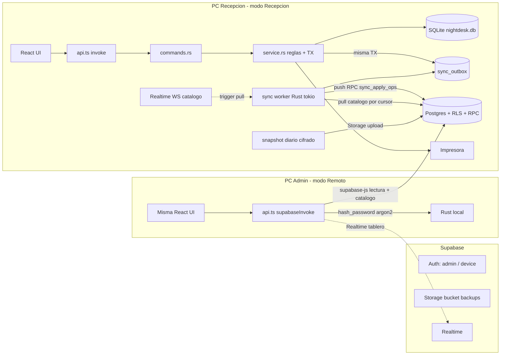

# Migración de arquitectura: VPN/API privada → Supabase

## Decisiones fijadas (17/09/2026)

- Un solo binario Tauri con dos modos por equipo: **Recepción** (SQLite local, sync worker, impresora) y **Administración remota** (sin datos de negocio locales; lee/escribe en Supabase). El modo se elige en el primer arranque y se guarda como ajuste de dispositivo.
- SQLite en recepción sigue siendo la única fuente operativa. Supabase es réplica de lectura para el admin + autoridad del catálogo + destino de respaldos. Se conserva el invariante de AGENTS: sin escritura remota directa sobre el archivo SQLite ni segunda base editable.
- Escritura remota del admin: solo `rooms` (número, tipo, piso, notas, activo), `rate_plans`, `products`, ajustes del negocio y `users`. Tablero, cuentas, reservas e historial son solo lectura remota.
- Regla de conflicto por propiedad, no por «último gana»:
  - Catálogo y ajustes del negocio → **Supabase gana**. Con sync habilitado, toda edición de catálogo (incluso desde la PC de recepción) se escribe primero en Supabase y la pull la aplica localmente (write-through). Sin conexión, esas pantallas muestran «Requiere conexión con administración»; la operación de recepción no se ve afectada.
  - Ocupación, estadías, cargos, pagos, reservas, `rooms.status` → **recepción gana**. Único escritor = recepción; el admin no puede modificarlos en Supabase (RLS).
- Recepción sin internet N horas: opera igual; la cola `sync_outbox` acumula y al volver se drena FIFO en lotes idempotentes; luego una pull completa del catálogo.
- Realtime es el **disparador** de la pull, no la fuente de verdad: si el websocket falla, la pull en reconexión y un poll de seguridad lento (5 min) garantizan convergencia.
- Se mantiene el snapshot diario cifrado (VACUUM INTO + gzip + cifrado) subido a **Supabase Storage** con retención 7/30/12; sustituye D09 (S3/VPS). D08 (CGNAT/handshake) deja de aplicar.
- Los datos pendientes D08/D09 desaparecen; se reemplazan por: URL/anon key del proyecto, credenciales del dispositivo recepción y del admin, y custodio de la clave de cifrado (D10 sigue).

## Arquitectura objetivo

## Modelo de sincronización

**Identidad de filas.** Migración `014_sync` agrega `uid TEXT NOT NULL UNIQUE` (UUID v4) a `rooms`, `rate_plans`, `products`, `guests`, `reservations`, `stays`, `charges`, `payments`, `users`, con backfill para filas existentes. Postgres usa `uid` como PK y FK; SQLite conserva el `id INTEGER` para el contrato IPC v1 (la UI no cambia). Evita colisiones de IDs entre escritores y hace los ops idempotentes por entidad.

**Versionado.** `version INTEGER NOT NULL DEFAULT 1` y `updated_at` en tablas de catálogo (ambos lados). El `expected_version` ya reservado en el contrato pasa a validarse en la escritura de catálogo; mismatch → `conflict` y recarga.

**Outbox (recepción → Supabase).** Tabla local `sync_outbox(id, operation_id UUID UNIQUE, entity, entity_uid, op, payload JSON, created_at, attempts, last_error, status pending|sent|rejected)`. `service.rs` la escribe **dentro de la misma transacción** que el cambio de negocio en: check-in, checkout/`close_account` (incluye cargos computados y pago), `add_charge`, `add_product_charge`, `delete_charge` (soft: `deleted_at`), `convert_to_overnight`, `set_room_status`, `create_reservation`, `set_reservation_status`, `check_in_reservation`, alta de huésped. El `operation_id` del cliente (ya generado en `api.ts` `withOperationId`) se reutiliza como clave idempotente de extremo a extremo. El worker envía lotes FIFO (p. ej. 200 ops) a una RPC `sync_apply_ops(device_id, ops jsonb)` que corre en una sola TX de Postgres, ignora ops ya registrados en `sync_applied_ops(operation_id PK)` y hace upsert incondicional (recepción manda). Backoff exponencial 5 s → 60 s.

**Pull (Supabase → recepción).** Cursor en `sync_state(key, value)` por tabla de catálogo (`rooms`, `rate_plans`, `products`, `business_settings`, `app_users`). Consulta `updated_at > cursor ORDER BY updated_at`, aplica en una TX local (upsert por `uid`, asigna `id` local a filas nuevas, **nunca toca `rooms.status`** ni claves de dispositivo) y guarda como nuevo cursor el máximo `updated_at` **del servidor** (no el reloj local, para evitar desfasajes). Al terminar emite un evento Tauri `sync:catalog-updated` que las pantallas escuchan para refrescar. Disparadores: arranque, reconexión, mensaje Realtime, poll de seguridad.

**Realtime.** El worker Rust abre el websocket de Realtime (protocolo Phoenix vía `tokio-tungstenite`) suscripto a `postgres_changes` de las tablas de catálogo; cada mensaje dispara una pull incremental (no se aplica el payload del evento directamente). Plan B documentado: suscribirse con `supabase-js` desde la webview y llamar al comando `sync_pull_now`, si el cliente Rust cuesta más de lo previsto. En modo remoto, el admin usa Realtime de `supabase-js` sobre `stays`, `rooms`, `charges` para ver el tablero en vivo.

**Ajustes divididos.** Claves de negocio sincronizadas: `business_name`, `address`, `phone`, `tax_percent`, `currency_symbol`, `receipt_footer`, encabezado de ticket, `require_guest_name`. Claves de dispositivo locales: `theme`, `printer_`*, `paper_width`, `auto_print_on_checkout`, `pin_hash`, `device_mode`, `sync_*`. Sin cambio de esquema; es una lista blanca en el módulo de sync y en `save_settings`.

**Usuarios.** `app_users` en Postgres (uid, username, password_hash Argon2, role, active, version). El admin remoto crea/desactiva/cambia rol; el hash se calcula en Rust local del admin (`hash_password`) y viaja ya hasheado. Recepción lo pulla a `users`. Login de recepción sigue 100 % local; `login_attempts` no se sincroniza.

**Casos borde definidos.**

- Habitación desactivada por el admin con estadía abierta: la pull aplica `active=0`; el tablero la sigue mostrando mientras haya stay `open` (regla de `display_status`).
- Nunca se borran filas sincronizadas; bajas lógicas (`active`, `deleted_at`).
- Primer arranque de sync (bootstrap): si el catálogo remoto está vacío, se sube el local; si no, se sobreescribe el local. Luego se sube el histórico operativo por lotes.
- Preview de cuenta en modo remoto: se calcula con `billing.ts` y se marca como estimativo; el importe definitivo llega con el cierre desde recepción.

## Seguridad en Supabase

- Auth: usuario admin (email/password, `app_metadata.role='admin'`) y un usuario por dispositivo de recepción (`app_metadata.role='device'`, `device_id`). Credenciales del dispositivo en Windows Credential Manager (`keyring`), nunca en `settings` ni en el repo. Solo anon key en las apps; la `service_role` no sale del panel.
- RLS: admin SELECT en todo, INSERT/UPDATE solo en catálogo y `app_users`, con trigger que impide cambiar `rooms.status` y columnas operativas. Device SELECT en catálogo y ejecución de `sync_apply_ops` (SECURITY DEFINER con verificación de rol); sin escritura directa en tablas operativas.
- `sync_devices(device_id, name, last_seen_at, last_push_at, pending_hint)` para que el admin vea «Recepción conectada / última sincronización».
- Bucket privado `backups`: device solo INSERT; admin SELECT; borrado por política de retención en una Edge Function programada (cron).

## Cambios por capa

**SQLite / Rust (`src-tauri/`)**

- `migrations/014_sync.sql` + entrada en `db.rs` (uid, version, updated_at, `sync_outbox`, `sync_state`, `charges.deleted_at`).
- Nuevo módulo `src/sync/` (`outbox.rs`, `push.rs`, `pull.rs`, `realtime.rs`, `client.rs` con trait `RemoteClient` y fake para tests, `worker.rs`). Estado en `AppState` y arranque del worker en `lib.rs` solo en modo recepción con sync configurado.
- `service.rs`: `enqueue` en cada mutación operativa listada; write-through de catálogo cuando sync está habilitado; `save_settings` respeta la lista blanca.
- Comandos nuevos (seguir skill `nightdesk-add-command`): `sync_status`, `sync_pull_now`, `sync_configure_device`, `device_mode_get/set`, `hash_password`, `backup_run_now`, `backup_status`.
- `backup.rs`: snapshot `VACUUM INTO` → gzip → cifrado AES-GCM con clave del custodio → subida a Storage con nombre único y manifiesto (reutiliza cifras de I03).
- Crates: `reqwest` (rustls), `tokio-tungstenite`, `uuid`, `keyring`, `flate2`, `aes-gcm`.

**Supabase (`supabase/` nuevo en el repo)**

- `supabase/migrations/0001_schema.sql`: tablas espejo con `uid uuid PK`, `local_id`, `updated_at`, `version`; `sync_applied_ops`, `sync_devices`; triggers `set_updated_at`/`bump_version`.
- `0002_rls.sql`: funciones `is_admin()`/`is_device()`, políticas por tabla, trigger de columnas protegidas.
- `0003_rpc.sql`: `sync_apply_ops`, `sync_bootstrap_catalog`, `catalog_upsert_*` con `expected_version`.
- Publicación Realtime solo sobre tablas de catálogo (+ `stays`/`rooms`/`charges` para el tablero admin).
- Edge Function `backups-retention` (cron diario) para 7/30/12.

**Frontend (`src/`)**

- `src/lib/supabase.ts`: cliente y `supabaseInvoke(name, args)` que implementa los mismos nombres de comando del contrato v1 contra PostgREST/RPC (lecturas de tablero/historial/reservas; escrituras de catálogo; `forbidden` para operativo). `cmd()` en `api.ts` elige `invoke | supabaseInvoke | mockInvoke` según modo.
- `LoginPage`: en modo remoto, login con Supabase Auth (`persistSession: false`, coherente con `acceso-sesiones.md`).
- Pantalla de primer arranque «Rol de este equipo»; `SettingsPage` gana sección «Sincronización y respaldo» (estado, última push/pull, cola pendiente, configurar dispositivo, ejecutar respaldo).
- `AppShell`: indicador de conexión/sync (Night Ops, ver skill `nightdesk-design`) y escucha de `sync:catalog-updated` para refrescar.
- `types.ts`/`mock.ts`: espejo de los tipos nuevos; el mock simula estados de sync.

**Documentación y reglas**

- Nuevo `docs/arquitectura-offline-supabase.md` con la misma estructura de secciones (alcance, arquitectura, comunicación y conflictos, roles, persistencia, respaldo, criterios, orden de implementación). `docs/arquitectura-offline-vpn-backups.md` queda con encabezado «Sustituido el 17/09/2026» y enlace. `docs/viabilidad-conectividad-respaldos.md`: nota de cierre (D08 no aplica, D09 = Storage).
- `docs/contrato-ipc-api.md`: sección Transporte (Supabase reemplaza `/api/v1`), semántica real de `operation_id`/`expected_version`, comandos nuevos.
- `AGENTS.md` (párrafo de arquitectura, mapa con `sync/`, `backup.rs`, `supabase/`) y skills `nightdesk-conventions` (sección Offline) y `nightdesk-add-command` (regla: mutación operativa → `enqueue`; comando nuevo → caso en `supabaseInvoke`). Opcional: skill `nightdesk-sync`.

## Fases y entregables

1. **F0 Decisión y documentos**: arquitectura nueva, contrato actualizado, AGENTS/skills, proyecto Supabase creado y `supabase/` inicializado. Sin código de negocio.
2. **F1 Fundaciones locales**: `014_sync`, `uid`/`version`, `sync_outbox` escrito en TX desde `service.rs`, lista blanca de ajustes, tests `cargo test` (rollback elimina el op, idempotencia por `operation_id`).
3. **F2 Esquema Supabase**: tablas, RLS, RPC `sync_apply_ops` idempotente, Realtime, usuarios Auth admin/device, bootstrap. Pruebas SQL con dos roles.
4. **F3 Worker de sync en recepción**: `client.rs`, push FIFO con backoff, pull por cursor, Realtime trigger, poll de seguridad, comandos `sync_`*, indicador en `AppShell`, sección en Ajustes. Prueba: 6 h offline simuladas → cola en orden → catálogo actualizado.
5. **F4 Modo administración remota**: selección de modo, `supabaseInvoke`, login Supabase, tablero/historial/reservas en vivo solo lectura, edición de catálogo/ajustes/usuarios con `expected_version`, estado del dispositivo.
6. **F5 Respaldo diario a Storage**: `backup.rs`, planificador 04:00 con reintentos, manifiesto, bucket y retención, restauración probada en otro equipo (D10 custodio).
7. **F6 Endurecimiento y entrega**: criterios de aceptación, instalador con selección de modo, checklist operativo, capacitación.

## Criterios de aceptación (reemplazan §9)

- Sin internet: login local, ingreso, consumos, cierre e impresión funcionan; la cola crece sin afectar la UI.
- Admin cambia una tarifa desde su PC: recepción la ve en < 3 s con conexión sana; las cuentas cerradas no cambian.
- Recepción sin conexión intenta editar catálogo: mensaje claro, sin escritura local divergente.
- Corte de 6 h con 50+ operaciones: al reconectar se aplican en orden, sin duplicados (repetir el lote no duplica), y el tablero admin coincide con recepción.
- Dos admins editan la misma tarifa: el segundo recibe `conflict` y recarga; nada se pierde en silencio.
- Admin intenta modificar una estadía o `rooms.status` vía cliente: RLS lo rechaza.
- Websocket caído: la pull en reconexión y el poll convergen igual.
- Snapshot diario íntegro, cifrado, en Storage; restauración en otro equipo recupera cuentas, catálogo y tickets.
- Credenciales del dispositivo fuera del repo/logs; `service_role` nunca en las apps.

## Reestructuración Jira ejecutada (17/09/2026)

Se conservaron las 6 épicas y las claves existentes (sin borrar nada) para no perder historial ni vínculos; las tareas VPN se reescribieron en su lugar con el mismo asignado. Mapa fase → Jira:

- **F0 docs** → I12 `MOT-79` (Iván, S1) + I03.1 `MOT-38` (cierre documental D08/D09).
- **F1 fundaciones locales** → I06 `MOT-18` (Iván, S2): I06.1 `MOT-51` migración 014, I06.2 `MOT-52` outbox en TX + lista blanca, I06.3 `MOT-53` pruebas cargo.
- **F2 esquema Supabase** → N12 `MOT-80` (Naser, S2): N12.1 `MOT-81` proyecto + 0001 schema, N12.2 `MOT-82` RLS + Auth, N12.3 `MOT-83` RPC + Realtime.
- **F3 worker** → I07 `MOT-21` (Iván, S3): I07.1 `MOT-59` cliente + push, I07.2 `MOT-60` pull por cursor, I07.3 `MOT-84` Realtime/poll/comandos `sync_*`. Catálogo write-through → I11 `MOT-73` (Iván, S3): `MOT-76/77/78`.
- **F4 modo remoto** → N07 `MOT-19` (Naser, S3): N07.1 `MOT-54` modo + `supabaseInvoke`, N07.2 `MOT-55` login Auth + tablero en vivo, N07.3 `MOT-56` indicador en recepción, N07.4 `MOT-85` edición remota de catálogo.
- **F5 respaldo** → I05 `MOT-17` (S2), I08 `MOT-22` (Iván, S3, Storage): `MOT-61/62/63`; N08 `MOT-20` (Naser).
- **F6 entrega** → N09 `MOT-23`, I09 `MOT-24` (`MOT-66/67` redefinidas), I10 `MOT-25`, N10 `MOT-26`.
- Vínculos Blocks: I12→I06, I12→N12, N12→I07/N07/I11/I08/I09, I06→I11, I04→I11, I11→N07.
- Sprints: S2 objetivo actualizado; S3 renombrado «S3 — Supabase y respaldo». Comentario de decisión en `MOT-4`.
- Ruta crítica: I12 (S1) → I06 ∥ N12 (S2) → I07 ∥ N07 ∥ I11 (S3) → S4.

## Riesgos y supuestos

- Cliente Realtime en Rust: riesgo de esfuerzo; mitigado por diseño «Realtime = disparador» y plan B en webview.
- Capacidad del equipo ya está ajustada (N01 §8): las fases se diseñaron para entregables pequeños y demostrables por semana.
- Plan Supabase Free alcanza para este volumen (catálogo < 1 MB, ~130 KiB/día de snapshot); Pro solo si se quiere PITR.
- Jira ya reestructurado (ver sección anterior). El proyecto Supabase no se crea hasta N12.1.

