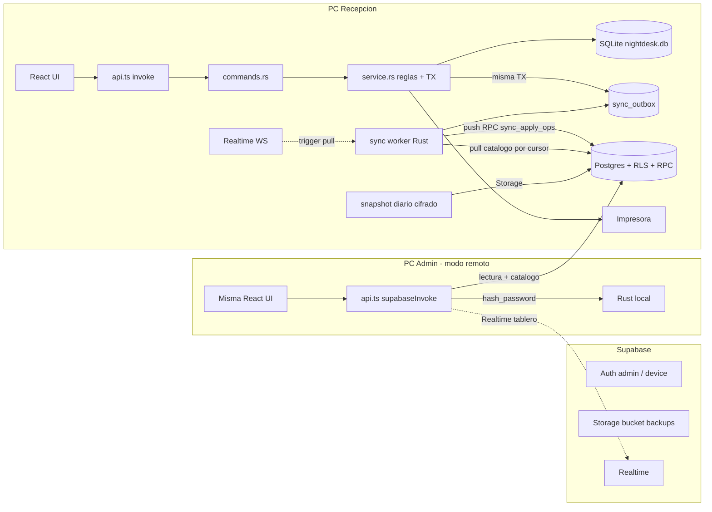

# Operación local, administración remota y respaldos (Supabase)

Fecha: 17 de septiembre de 2026.
Estado: requisitos y arquitectura acordados. I12 y N12 documentados/aplicados; I06 (`014_sync`, outbox local), I07 (worker push/pull/Realtime) e I11 (write-through / `catalog_write` / auditoría) implementados. N07 modo remoto hecho. Pendiente I08 (backups).

Este documento sustituye el 17/09/2026 a [arquitectura-offline-vpn-backups.md](arquitectura-offline-vpn-backups.md). La operación del motel sigue sin depender de internet. Supabase se usa para que el admin consulte y edite catálogo a distancia, para replicar la operación en lectura y para el respaldo diario cifrado. No describe funciones ya terminadas ni modifica el presupuesto comercial.

**Decisión 17/09/2026 (Iván y Naser):** se descarta WireGuard + API HTTP privada + servicio Windows (D08: handshake dependiente de router/CGNAT/intermediario). Supabase (Postgres + Auth + RLS + Realtime + Storage) los reemplaza. SQLite en recepción sigue siendo la única fuente operativa. No hay escritura remota directa sobre su archivo ni una segunda base editable.

## 1. Alcance

- 23 habitaciones: 19 normales y 4 con jacuzzi.
- Un solo binario de escritorio Windows. En el primer arranque se elige el rol del equipo: **Recepción** o **Administración remota**.
- Inicio de sesión individual con roles `admin` y `recepcion` en la app. En Supabase Auth: usuario `admin` y un usuario `device` por PC de recepción.
- El admin remoto consulta tablero, historial y reservas en vivo (solo lectura) y modifica catálogo, ajustes del negocio y usuarios. Esta decisión reemplaza tanto el administrador de solo consulta como la escritura remota operativa de la propuesta VPN.
- Recepción conserva habitaciones, estadías, consumos, cuentas e impresión **sin internet**.
- Solo la PC de recepción tiene impresora. El modo remoto no dispara impresión ni PDF.
- Respaldo diario cifrado a un bucket privado de Supabase Storage, con reintentos si no hay conexión.
- No se integra procesamiento de pagos ni facturación electrónica.

## 2. Estado actual verificado

- Tauri y React usan `src/lib/api.ts` como puente hacia comandos Rust (`invoke`) o el mock (`mockInvoke`). Aún no existe `supabaseInvoke`.
- SQLite está en el directorio de datos de la aplicación (`nightdesk.db`), fuera del repositorio. WAL y claves foráneas están habilitados.
- Roles, sesiones Argon2id, cierre transaccional, tickets, PDF diario y catálogo local están implementados (N01–N06, N11, I01–I04).
- `uid`/`version`/`updated_at`, `charges.deleted_at`, `sync_outbox` y `sync_state` viven en SQLite (`014_sync`). El worker I07 drena la outbox, hace pull por cursor y escucha Realtime. La subida diaria a Storage sigue pendiente (I08). El esquema Supabase (N12) ya existe.
- Migraciones SQLite aplicadas hasta `014_sync`.
- I03 midió el snapshot: un mes sintético gzip ≈ 132 KiB. Esa cifra se reutiliza para Storage.

## 3. Arquitectura objetivo

SQLite en recepción es la única autoridad operativa. Supabase es réplica de lectura para el admin, autoridad del catálogo y destino de respaldos. La UI nunca importa Tauri ni `supabase-js`: `cmd()` elige `invoke` | `supabaseInvoke` | `mockInvoke` según el modo del equipo.

No hay servicio Windows. El worker de sync y el planificador de respaldo viven dentro de la app de recepción. Al abrirla se drena la cola y se hace una pull completa. El admin no necesita que esa PC esté encendida para consultar: lee la réplica.

## 4. Comunicación, sincronización y conflictos

### Propiedad de datos (no «último gana»)

| Dominio | Quién escribe | Quién gana |
|---|---|---|
| Catálogo: `rooms` (número, tipo, piso, notas, `active`), `rate_plans`, `products`, ajustes del negocio, `users` / `app_users` | Admin remoto; recepción solo con sync (write-through) | **Supabase** |
| Operación: estadías, cargos, pagos, reservas, `rooms.status`, huéspedes | Solo recepción | **Recepción** |

Con sync habilitado, una edición de catálogo (incluso desde la PC de recepción) se escribe primero en Supabase con `expected_version` y la pull la aplica localmente. Sin conexión, esas pantallas muestran «Requiere conexión con administración» y **no** escriben en SQLite. Sin dispositivo configurado (instalación puramente local) el catálogo sigue operando en SQLite como hoy.

El admin remoto no puede modificar `stays`, `charges`, `payments`, `reservations` ni `rooms.status`. RLS lo rechaza. Preview de cuenta en remoto se calcula con `billing.ts` y se marca como estimativo; el importe definitivo llega con el cierre desde recepción.

### Identidad y versiones

Migración `014_sync` (I06) agrega `uid TEXT NOT NULL UNIQUE` (UUID v4) a `rooms`, `rate_plans`, `products`, `guests`, `reservations`, `stays`, `charges`, `payments`, `users`, con backfill. Postgres usa `uid` como PK; SQLite conserva `id INTEGER` para el contrato IPC v1 (la UI no cambia).

Tablas de catálogo llevan `version INTEGER NOT NULL DEFAULT 1` y `updated_at`. `expected_version` deja de ignorarse: si no coincide, `conflict` y recarga. Nunca se borran filas sincronizadas; bajas lógicas (`active`, `deleted_at` en cargos).

### Outbox (recepción → Supabase)

Tabla local `sync_outbox(id, operation_id UUID UNIQUE, root_operation_id, entity, entity_uid, op, payload JSON, created_at, attempts, last_error, status pending|sent|rejected)`. `service.rs` la escribe **en la misma transacción** que el cambio de negocio en: check-in, checkout (cargos computados; hoy no hay pago), `add_charge`, `add_product_charge`, `delete_charge` (lógico), `convert_to_overnight`, `set_room_status`, `create_reservation`, `set_reservation_status`, `check_in_reservation` y alta de huésped. Un checkout u otra mutación compuesta comparte `root_operation_id`; los sub-ops derivan un UUID v5 para no chocar con `sync_applied_ops`.

El `operation_id` que ya genera `api.ts` (`withOperationId`) es la clave idempotente de extremo a extremo (`sync_outbox` y `sync_applied_ops` en Postgres). El worker envía lotes FIFO (hasta 200) a la RPC `sync_apply_ops(device_id, ops jsonb)`: una sola TX, ignora ops ya aplicadas, upsert incondicional (recepción manda). Backoff 5 s → 60 s. Una op pasa a `sent` solo tras confirmación. Un error `validation:` aísla la op culpable (`rejected`) y sigue con el resto del lote.

### Pull (Supabase → recepción)

Cursor por tabla de catálogo en `sync_state` (`pull_cursor:<tabla>`). Consulta `updated_at >= cursor ORDER BY updated_at` (páginas de 500), aplica en una TX local (upsert por `uid`, asigna `id` local a filas nuevas), **nunca toca `rooms.status`** ni claves de dispositivo, y guarda como cursor el máximo `updated_at` **del servidor** solo si la TX confirmó. `gte` + idempotencia por `version` evita perder filas con el mismo timestamp. Si el `username` de `app_users` ya existe en local, se adopta el `uid` remoto. Al terminar emite el evento Tauri `sync:catalog-updated` (re-despachado a `window` desde `api.ts`).

Disparadores: arranque, reconexión, mensaje Realtime, poll de seguridad cada 5 min, `sync_pull_now`. Realtime es disparador en Rust (`tokio-tungstenite`, token del dispositivo no sale de Rust): el payload del evento no se aplica directo.

### Bootstrap

Si el catálogo remoto está vacío (`sync_bootstrap_catalog` → `accepted:true`), se sube el local. Si no, se sobreescribe el local (incluso si la versión local es mayor; `rooms.status` intacto) y luego se sube el histórico operativo por lotes: `guests` → `rooms` (status) → `reservations` → `stays` → `charges`, con `root_operation_id = uuid_v5(bootstrap:<entidad>:<uid>)` para no duplicar. `sync_state.bootstrap_done` evita repetirlo. Tras restaurar un snapshot: borrar `bootstrap_done`, `pull_cursor:*` y la outbox.

### Ajustes divididos (lista blanca)

Sincronizados: `business_name`, `address`, `phone`, `tax_percent`, `currency_symbol`, `receipt_footer`, encabezado de ticket, `require_guest_name`. Locales: `theme`, `printer_*`, `paper_width`, `auto_print_on_checkout`, `pin_hash`, `device_mode`, `sync_*`.

### Casos borde

- Habitación desactivada por el admin con estadía abierta: la pull aplica `active=0`; el tablero la sigue mostrando mientras haya stay `open`.
- Timeout tras enviar un lote: consultar `sync_applied_ops` antes de reintentar. Repetir el mismo `operation_id` no duplica.
- Reloj local desfasado no rompe cursores: se usa `updated_at` del servidor.
- Tras restaurar un snapshot: limpiar `sync_outbox`/`sync_state` y volver a bootstrap para no reenviar operaciones antiguas.

## 5. Roles e inicio de sesión

Matriz para el **modo Administración remota**. En recepción, IPC sigue la matriz de I04 (admin local puede operar el motel).

| Operación | Recepción (IPC, local) | Admin remoto (Supabase) |
|---|---|---|
| Consultar tablero, cuentas, reservas, historial | Sí | Sí, solo lectura, en vivo |
| Iniciar y finalizar estadías, consumos, reservas, limpieza | Sí | No (`forbidden` / RLS) |
| Anular cargos, descuentos, corregir cuentas cerradas | No (hace falta admin local) | No |
| Cambiar tarifas, habitaciones (sin `status`), catálogo, ajustes del negocio | Admin local, write-through si hay sync | Sí, con `expected_version` |
| Administrar usuarios de la app | Admin local | Sí; el hash Argon2 se calcula en Rust (`hash_password`) |
| Configurar o restaurar respaldos | Admin local | Ver estado; restaurar solo en el equipo de recepción |
| Imprimir, reimprimir, PDF diario | En recepción | `forbidden` |

- Autorización en Rust (`service::authorize`) **y** en Postgres (RLS). Ocultar botones no basta.
- Login de recepción: 100 % local (Argon2id, sesiones en memoria, límite de intentos). Ver [acceso-sesiones.md](acceso-sesiones.md). `login_attempts` no se sincroniza.
- Login del modo remoto: Supabase Auth, `persistSession: false`, sesión en memoria.
- Usuarios de la app se replican en `app_users` (uid, username, password_hash, role, active, version). El admin remoto crea/desactiva/cambia rol; recepción lo recibe por pull.
- Auth de dispositivo: `app_metadata.role = 'device'` + `device_id`. Credenciales en Windows Credential Manager (`keyring`), nunca en `settings`, repo, logs ni frontend.
- Solo la anon key viaja en las apps. La `service_role` no sale del panel.
- Auditoría de catálogo: actor, fecha UTC, equipo, entidad, valores anterior/nuevo. Sin secretos.

## 6. Persistencia local

Se conservan habitaciones, tarifas, productos, reservas, estadías, consumos, cuentas e información mínima de huéspedes. Se añaden `uid`, `version`, `updated_at`, `sync_outbox`, `sync_state`, `charges.deleted_at` y auditoría de catálogo.

- Montos enteros en guaraníes; campos `*_cents`.
- SQLite en disco local; no carpeta compartida ni el archivo de Supabase como base activa.
- Operaciones de varios pasos transaccionales. Una estadía `open` por habitación.
- Tarifas y detalle de cierre persistidos para reimprimir fielmente.
- Migraciones versionadas: solo las no aplicadas, en transacción, con respaldo previo.
- Fechas en UTC; UI en zona del motel.
- Disco lleno, base bloqueada o error de escritura: mensaje claro, sin éxito antes del commit. La red **nunca** bloquea la UI de recepción.

## 7. Respaldo diario a Supabase Storage

La réplica continua en Postgres es una vista operativa, no una copia versionada. El snapshot diario es independiente.

### Flujo

1. Planificador **dentro de la app** (04:00 propuesto, configurable). Sin servicio Windows. Al iniciar, si falta el respaldo del día, se genera; no se inventan días apagados.
2. Snapshot consistente con Online Backup API / `VACUUM INTO` (I05), base abierta. No copiar solo `.db` con WAL activo (I03 §3: el WAL contenía casi todo el estado).
3. Integridad + manifiesto: ID del motel, ID de respaldo, fecha UTC, versión de esquema/app, tamaño, checksum SHA-256.
4. Gzip y cifrado AES-GCM **antes** de encolar. Clave custodiada fuera de la PC (D10).
5. Subida HTTPS al bucket privado `backups` con el usuario `device` (solo INSERT), nombre de objeto único. Reintentos sin duplicar.
6. Éxito solo tras confirmación de tamaño/checksum. Registrar el manifiesto en la tabla `backups`. Mostrar por separado última copia local y última remota confirmada.
7. Retención 7 locales / 30 diarias / 12 mensuales. Lo remoto lo aplica una Edge Function programada. Nunca eliminar la última copia válida durante un fallo.

Un corte de Storage o de red no bloquea ingresos, cuentas ni impresión. Aviso si pasan más de 24 h sin copia remota confirmada.

Restauración: solo admin en el equipo de recepción. Suspender escrituras, copiar el estado actual, descargar con sesión admin, descifrar, comprobar integridad y migraciones, restaurar, validar habitaciones/cuentas/historial/tickets, revocar sesiones, limpiar `sync_outbox`/`sync_state` y re-bootstrap. Una copia cuenta después de una restauración real en otro equipo.

## 8. Disponibilidad remota (sin VPN)

Ambas PCs salen por HTTPS hacia Supabase. No hay UDP 51820, port-forward ni intermediario WireGuard. D08 deja de aplicar. D09 queda cerrado: el destino es Storage del mismo proyecto.

El admin consulta aunque recepción esté apagada (réplica). Los cambios de catálogo se reflejan en recepción al reconectar (o en < 3 s con conexión sana y Realtime). Un corte de 6 h en recepción no detiene el motel: la cola crece y se drena en orden al volver.

## 9. Criterios de aceptación

- Sin internet: login local, ingreso, consumos, cierre e impresión funcionan; la cola crece sin afectar la UI.
- Admin cambia una tarifa desde su PC: recepción la ve en < 3 s con conexión sana; las cuentas cerradas no cambian.
- Recepción sin conexión intenta editar catálogo: mensaje claro, sin escritura local divergente.
- Corte de 6 h con 50+ operaciones: al reconectar se aplican en orden; repetir el lote no duplica; el tablero admin coincide con recepción.
- Dos admins editan la misma tarifa: el segundo recibe `conflict` y recarga.
- Admin intenta modificar una estadía o `rooms.status` vía cliente: RLS lo rechaza.
- Websocket caído: la pull en reconexión y el poll convergen igual.
- Snapshot diario íntegro, cifrado, en Storage; restauración en otro equipo recupera cuentas, catálogo y tickets.
- Credenciales del dispositivo fuera del repo/logs; `service_role` nunca en las apps.
- Reimpresión ocurre en recepción y no altera el cierre.

## 10. Orden de implementación

Trazado en Jira MOT. Documentación de este archivo: I12 (`MOT-79`).

1. **I12** — este documento, contrato, AGENTS y skills.
2. **I06** (`MOT-18`, S2) — hecho: `014_sync`, outbox en TX, lista blanca, `expected_version` local. En paralelo **N12** (`MOT-80`) — hecho: esquema, RLS, RPC, Realtime, Auth, bucket.
3. **I07** (`MOT-21`, S3) — worker push/pull/Realtime (**hecho**). **I11** (`MOT-73`) — write-through y `hash_password` (**hecho**). **N07** (`MOT-19`) — modo remoto (**hecho**).
4. **I05** snapshot local; **I08** (`MOT-22`) subida a Storage; **N08** visibilidad.
5. Instalador con selección de modo, pruebas (I09: RLS, replay, 6 h, Storage caído) y aceptación.

## 11. Datos pendientes para desplegar

Reemplazan D08 (VPN) y D09 (S3/VPS). En git/Jira solo «configurado» y quién custodia; secretos por canal seguro.

- URL del proyecto Supabase y anon key (configuración de app, no `service_role`).
- Usuario Auth admin (`app_metadata.role = 'admin'`) y usuario `device` de la PC de recepción (`device_id`).
- Custodio de la clave de cifrado AES-GCM y quién prueba la restauración en otro equipo (D10 se mantiene). Horario 04:00 sigue propuesto.
- Nombres de usuarios iniciales de la app y aceptación de la matriz de permisos de §5.
- Política de conservación de datos personales y permisos del usuario de Windows sobre la base.

## Referencias técnicas

- [SQLite como almacenamiento local](https://www.sqlite.org/whentouse.html)
- [SQLite Online Backup API](https://www.sqlite.org/backup.html)
- [SQLite y acceso por red](https://www.sqlite.org/useovernet.html) — no exponer el archivo
- [Supabase Auth](https://supabase.com/docs/guides/auth)
- [Row Level Security](https://supabase.com/docs/guides/database/postgres/row-level-security)
- [Realtime](https://supabase.com/docs/guides/realtime)
- [Storage](https://supabase.com/docs/guides/storage)
- Contrato: [contrato-ipc-api.md](contrato-ipc-api.md)
- Medición de snapshot: [viabilidad-conectividad-respaldos.md](viabilidad-conectividad-respaldos.md) §3
