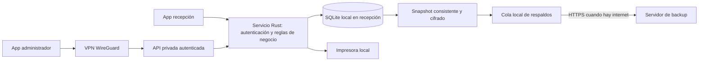

# Operación local, acceso remoto y respaldos

Fecha: 10 de septiembre de 2026.
Estado: requisitos y arquitectura acordados; implementación pendiente.

Este documento reemplaza la restricción anterior de ausencia total de red. La operación del motel sigue sin depender de internet. Internet se utiliza para respaldos externos y para consultar o modificar datos a distancia. No describe funciones ya terminadas ni modifica el presupuesto comercial.

## 1. Alcance

- 23 habitaciones: 19 normales y 4 con jacuzzi.
- App de escritorio para recepción y app de escritorio para administración.
- Inicio de sesión individual con roles `admin` y `recepcion`.
- Admin puede consultar y modificar información autorizada desde otra ubicación. Esta decisión reemplaza la propuesta previa de administrador remoto de solo consulta.
- Recepción conserva la operación local de habitaciones, estadías, consumos, cuentas e impresión sin internet.
- Solo la PC de recepción tiene impresora.
- Respaldo diario de datos a un servidor externo, con reintentos si no hay conexión.
- No se integra procesamiento de pagos. El código actual todavía conserva flujos de cobro que deben adecuarse al alcance.

## 2. Estado actual verificado

- Tauri y React usan `src/lib/api.ts` como puente IPC hacia comandos Rust.
- SQLite está en el directorio de datos de la aplicación (`nightdesk.db`), fuera del repositorio.
- Se habilitan claves foráneas y WAL.
- El cierre actual utiliza una transacción; el ingreso necesita agrupar sus cambios en una transacción.
- El navegador usa un mock en localStorage, independiente de SQLite.
- No están implementados la API HTTP de red, VPN integrada, roles completos ni subida diaria de respaldos.
- El seed aún crea 27 habitaciones. Corregir nuevas instalaciones y migrar instalaciones existentes sin borrar historiales.

## 3. Arquitectura objetivo

El servicio de recepción es la única autoridad sobre los datos. La API y los comandos locales deben reutilizar la misma capa de negocio y autorizaciones. No duplicar cálculos ni exponer directamente SQL o el archivo SQLite.

El servicio debe poder iniciar con Windows y funcionar aunque la ventana de la app esté cerrada. El instalador debe configurar los componentes necesarios y solicitar permisos de administrador cuando corresponda. Los detalles de empaquetado del servicio y VPN quedan pendientes de implementación.

## 4. Comunicación y cambios remotos

1. El administrador establece la VPN e inicia sesión contra el servicio de recepción.
2. La app consulta recursos mediante API HTTPS privada y recibe JSON. La confianza del certificado debe configurarse; no deshabilitar su validación.
3. Al modificar un dato, envía identificador, cambios, versión esperada e identificador único de operación.
4. El servicio valida sesión, rol, datos y reglas del negocio; guarda cambio y auditoría en una transacción.
5. Solo después del commit confirma el resultado a la app.
6. Recepción consulta cambios/versiones periódicamente y refresca las vistas afectadas. Objetivo inicial propuesto: reflejar cambios en hasta 5 segundos con conexión saludable. Al recuperar conexión realiza una consulta completa.

Los endpoints propuestos tendrán prefijo `/api/v1`. La app nunca podrá modificar datos de negocio mediante rutas de respaldo. Las credenciales de almacenamiento externo no se entregan a la app del administrador.

### Conflictos y reintentos

- Usar control de concurrencia por versión: una edición basada en datos antiguos debe devolver conflicto y requerir recarga; no sobrescribir silenciosamente.
- Cada operación mutante lleva un identificador idempotente persistido con su resultado. Repetir una solicitud después de un timeout no duplica consumos ni cierres.
- Un timeout no prueba que la operación falló: consultar su resultado antes de reenviar o mostrar éxito.
- No permitir ediciones remotas sin conexión ni mantener una segunda base editable. Puede conservarse una vista de consulta local con fecha de actualización y aviso visible de desconexión.
- La API solo acepta operaciones concretas, no sentencias SQL arbitrarias.
- El cierre fija importes y conceptos históricos. Cambiar tarifas no debe recalcular cuentas cerradas.

## 5. Roles e inicio de sesión

La siguiente matriz es la propuesta inicial de permisos para implementar:

| Operación | Recepción | Admin |
|---|---|---|
| Consultar tablero y cuentas operativas | Sí | Sí |
| Iniciar y finalizar estadías | Sí | Sí, sujeto a las mismas reglas |
| Agregar consumos y gestionar reservas | Sí | Sí |
| Marcar limpieza | Sí | Sí |
| Anular cargos, aplicar descuentos o corregir cuentas cerradas | No | Sí, con motivo y auditoría |
| Cambiar tarifas, habitaciones y catálogo | No | Sí |
| Administrar usuarios y permisos | No | Sí |
| Configurar o restaurar respaldos | No | Sí, con validaciones adicionales |
| Imprimir y reimprimir | En recepción | Desde el equipo de recepción |

- La autorización se comprueba en Rust para IPC y HTTP; ocultar botones no basta.
- Cuentas individuales; registrar usuario responsable, no un PIN compartido como única identidad.
- Contraseñas con Argon2id y salt aleatorio; sesiones con caducidad, revocación y límite de intentos.
- La autenticación local no depende del servidor de backup ni de un proveedor de identidad por internet.
- La VPN autoriza el dispositivo; no sustituye la autenticación de usuario ni su rol.
- La API debe restringirse a interfaces/redes autorizadas y firewall. No publicar SQLite ni la API administrativa directamente en internet.
- Guardar claves privadas y credenciales en almacenamiento protegido de Windows; nunca en el repositorio, logs, frontend o texto plano de configuración.
- Las anulaciones/correcciones conservan el registro original y un asiento de auditoría; no eliminar silenciosamente el historial.
- Auditoría local: actor, fecha UTC, equipo, operación, entidad, motivo y cambios relevantes. No registrar secretos y minimizar datos personales.

## 6. Persistencia local

Se conservan habitaciones, tarifas, productos, reservas, estadías, consumos, cuentas e información mínima de huéspedes cuando sea necesaria. Añadir usuarios, roles, sesiones protegidas, auditoría, versiones, resultados idempotentes y estado de respaldos.

- Montos enteros en guaraníes; conservar la convención existente hasta migrarla explícitamente.
- Mantener SQLite en el disco local; no usar una carpeta compartida o sincronizada como base activa.
- Todas las operaciones de negocio de varios pasos deben ser transaccionales.
- Agregar una restricción única parcial para una sola estadía abierta por habitación, previa revisión de datos existentes.
- Guardar las tarifas/reglas aplicadas y el detalle definitivo de cierre para reimprimir fielmente.
- Migraciones versionadas: ejecutar solo las no aplicadas, dentro de una transacción y con respaldo previo.
- Fechas persistidas en UTC; presentación según zona horaria del motel. Validar conversiones de las fechas actuales.
- Manejar disco lleno, base bloqueada y errores de escritura con mensajes claros, sin informar éxito antes del commit.

## 7. Respaldo diario externo

El servidor externo conserva copias versionadas para recuperación. No es la base operativa ni una fuente de sincronización hacia recepción. Un corte del servidor no bloquea ingresos, cuentas o impresión.

### Flujo

1. Un planificador del servicio ejecuta un respaldo al día en horario configurable del motel. Horario propuesto: 04:00, por confirmar.
2. Generar snapshot consistente con SQLite Online Backup API, con la base abierta. No copiar solamente `nightdesk.db` mientras WAL está activo.
3. Comprobar integridad del snapshot y guardar manifiesto: ID del motel, ID de respaldo, fecha UTC, versión del esquema/app, tamaño y checksum.
4. Cifrar el archivo antes de enviarlo y conservarlo en una cola local protegida.
5. Subir por HTTPS usando autenticación limitada al destino autorizado y un nombre de objeto único. Soportar reintento sin duplicar.
6. Marcar éxito solo después de confirmación del servidor y validación de tamaño/checksum. Mostrar por separado última copia local y última copia remota confirmada.
7. Aplicar retención únicamente sobre copias verificadas. Nunca eliminar la última copia válida durante un fallo de subida.

### Sin internet, PC apagada o error

- Conservar copias pendientes y reintentar con espera progresiva, sin bloquear el uso.
- Al iniciar el servicio, comprobar si falta el respaldo del día y generarlo; no inventar copias históricas de días en que la PC estuvo apagada.
- Tras varios días sin red, subir las copias pendientes según la política de espacio/retención y generar una actual.
- Advertir al administrador si pasan más de 24 horas sin respaldo remoto confirmado; umbral configurable.
- Un respaldo diario puede dejar hasta aproximadamente 24 horas de cambios sin protección externa en condiciones normales. Sin conexión durante días, la ventana de pérdida aumenta.
- La cola local no protege frente a pérdida del disco: se necesita una copia externa confirmada. Cifrar y proteger también cualquier copia en USB.

### Retención y restauración

Propuesta inicial, pendiente de capacidad y aprobación: 7 copias locales; 30 diarias y 12 mensuales remotas. Separar credenciales de subida y borrado cuando el servidor lo permita. Definir custodia y recuperación de la clave de descifrado fuera de la PC principal.

Restauración exclusiva del administrador: suspender escrituras locales/remotas, hacer copia del estado actual, descargar y descifrar, comprobar integridad y compatibilidad, restaurar de forma controlada y validar habitaciones, cuentas e historial antes de reabrir. Revocar sesiones restauradas y limpiar estados de clientes para no aplicar cambios antiguos. Una copia solo se considera recuperable después de una prueba real de restauración.

## 8. VPN y disponibilidad

Se propone WireGuard en los equipos autorizados. WireGuard no tiene cuota de suscripción; la conexión directa depende de router, firewall y proveedor. Revisar IPv4 pública/IPv6 y CGNAT. Si no se puede comunicar directamente, decidir si se usa un intermediario propio o servicio autorizado; no garantizar acceso directo antes de comprobarlo.

El servidor de backup puede ser infraestructura propia o almacenamiento contratado. Su alojamiento y operación no son automáticamente gratuitos. Aún no se han definido proveedor, dirección, capacidad ni credenciales. El backup y un eventual relay VPN son funciones distintas aunque puedan alojarse en infraestructura común, con separación de permisos.

## 9. Criterios de aceptación

- Sin internet: login local, ingreso, consumos, cierre de cuenta e impresión siguen funcionando.
- Admin remoto modifica una tarifa autorizada; recepción recibe el cambio y las estadías históricas no cambian.
- Recepción intenta una operación de admin por IPC/API: el backend la rechaza.
- Dos ediciones concurrentes: no se pierde silenciosamente ninguna modificación.
- Se corta internet después de guardar: consultar/reintentar no duplica la operación.
- Recepción y admin pierden conexión: admin ve desconexión y no puede guardar cambios remotos.
- Backup con escrituras activas: snapshot íntegro y restaurable.
- Sin red durante el horario programado: queda pendiente y se sube al recuperar conexión.
- Disco lleno o servidor caído: se informa el problema, sin falso éxito ni eliminación de la última copia válida.
- Restaurar en otro equipo recupera cuentas, consumos, habitaciones y configuración según lo documentado.
- Desactivar un usuario o revocar un equipo bloquea su acceso remoto.
- Reimpresión ocurre en recepción y no duplica ni altera el cierre.

## 10. Orden de implementación

1. Persistencia: transacciones, restricciones, migraciones, detalle histórico y adecuación al alcance de cuentas.
2. Usuarios, roles y auditoría en la capa de negocio compartida.
3. Copia local consistente y restauración probada.
4. API privada con autenticación, versiones e idempotencia; probar en red local.
5. VPN y administración remota desde la segunda app; validar cortes y conflictos.
6. Planificador y subida de backups cifrados al destino confirmado.
7. Instalador, recuperación, pruebas integrales y documentación de operación.

## 11. Datos pendientes para desplegar

- Servidor de respaldo: propio/contratado, protocolo, dirección y responsable. Credenciales por canal seguro, nunca en este Markdown.
- Horario, retención, capacidad, clave de recuperación y responsables de probar restauraciones.
- Proveedor/router del motel y ubicación de la PC administradora para validar conectividad.
- Nombres de usuarios iniciales y aceptación de la matriz de permisos.
- Política de conservación de datos personales y permisos del usuario de Windows sobre la base.

## Referencias técnicas

- [SQLite como almacenamiento local y detrás de un servicio](https://www.sqlite.org/whentouse.html)
- [SQLite Online Backup API](https://www.sqlite.org/backup.html)
- [SQLite y acceso por red](https://www.sqlite.org/useovernet.html)
- [WireGuard e integración en aplicaciones Windows](https://www.wireguard.com/embedding/)
