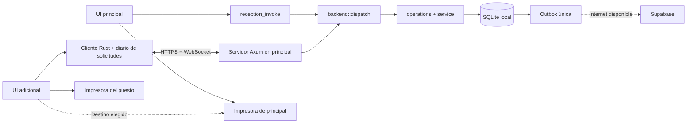

# Dos recepciones locales — implementación y piloto

Fecha: 03/10/2026. Contrato IPC 3, protocolo LAN 1.

## Autoridad y recorrido de una operación

El binario ofrece `reception` (principal), `reception_client` (adicional) y `remote` (administración por Supabase). La principal mantiene SQLite en su disco; la adicional envía comandos por HTTPS. No se comparte el archivo ni se replica una base editable en la adicional. Solo la principal inicia sincronización y respaldos.

`operations.rs` abre `BEGIN IMMEDIATE`; los servicios usan savepoints anidados. Cambios, resultado, auditoría y outbox se confirman juntos. Un UUID repetido con el mismo usuario estable, puesto y contenido devuelve el resultado guardado. Otro contenido/autor/puesto produce `conflict`. El registro no depende de que la outbox ya se haya enviado. Stock y promociones pasan por este mismo límite. Los adaptadores operativos antiguos ya no se registran en Tauri.

La consulta `account_quote` devuelve importe y token calculado a partir de versión operativa y líneas financieras. El cierre vuelve a calcular una sola factura dentro de la transacción y compara ese token antes de escribir. Un consumo, cambio de estado o salto de tarifa por tiempo invalida la confirmación; se muestra el nuevo importe para una nueva acción del usuario. El cierre deja la habitación sucia y no crea pagos.

Los triggers SQLite mantienen una revisión global y versiones operativas independientes del catálogo. Eventos publicados después del commit y un observador de 500 ms detectan también cambios provenientes del worker. WebSocket transmite solo época/revisión, no filas. Las vistas vuelven a consultar; conservan formularios abiertos. Una comprobación cada cinco segundos cubre eventos perdidos. Menos de un segundo p95 es el objetivo del piloto, no una medición certificada.

## Instalación del cliente

1. Aplicar primero `supabase/migrations/20261003120000_local_reception_audit.sql` y sus pruebas en un entorno de ensayo. La app anterior puede seguir usando el RPC extendido. La nueva outbox necesita que el RPC reconozca `operational_audit` antes de reconectar internet.
2. Crear un respaldo consistente y verificar su restauración en una instalación de ensayo. Detener la operación de ambos puestos para actualizar la principal. No copiar un SQLite abierto mediante el explorador.
3. Instalar la misma versión en dos PCs Windows. En instalaciones existentes se conserva `reception`, la base y la configuración previa. En la adicional elegir **Recepción adicional**: no crear otro administrador ni copiar `nightdesk.db`.
4. En la principal, ingresar como administrador → **Puestos**. Elegir la interfaz Ethernet/Wi-Fi privada del establecimiento, habilitar conexión (puerto predeterminado 17443), y ejecutar **Configurar firewall de Windows**. Windows solicita elevación para reglas limitadas al ejecutable, puerto, perfil privado y subred local. La escucha se limita a la interfaz seleccionada; descubrimiento usa UDP 5353.
5. Desde el tablero de la principal, abrir el control **LAN** de la cabecera. Su panel flotante busca puestos adicionales periódicamente; si LAN está detenida, permite activarla con la primera interfaz local disponible. En el primer arranque de la adicional, **Vincular con principal** busca la principal cada ocho segundos. La adicional anuncia su presencia mientras no esté vinculada. Abrir la vinculación por dos minutos, comparar la huella completa en ambas pantallas y solicitar desde la adicional. Aprobar en la principal solo el código que coincide. El descubrimiento no autoriza ningún acceso. Si mDNS está bloqueado, copiar los datos públicos de conexión manual desde **Puestos**; el certificado y su huella no son secretos. No abrir puertos en el router.
6. Ingresar con usuarios existentes. Cada puesto tiene su sesión y su impresora. En **Impresora**, elegir la cola instalada, ancho 58/80 mm y hacer una prueba. En la adicional puede elegirse la impresora publicada por la principal. Los drivers deben estar instalados antes de desconectar internet.
7. Desconectar la salida a internet conservando el switch/router local. Hacer el piloto de aceptación siguiente. Al devolver internet, verificar que la principal drena la cola y administración ve ambos autores.

Se recomienda Ethernet, reserva DHCP, principal sin suspensión durante la operación y UPS para principal/red. La app permanece en bandeja al cerrar su ventana con LAN habilitada. **Detener recepción y salir** termina también el servicio. El inicio automático existente ocurre tras iniciar sesión en Windows, no antes. No hay servicio Windows ni promoción automática de la adicional.

## Identidad, sesiones y recuperación

El certificado TLS y la credencial aleatoria del puesto se guardan en Windows Credential Manager (en otros SO, archivo privado 0600 para desarrollo). Se fija el certificado aprobado; no se usa `accept_invalid_certs`. Las peticiones se resuelven a IPv4 privada/link-local/loopback y no usan proxy ni redirecciones. mDNS puede actualizar dirección y puerto únicamente para la identidad ya fijada. La principal detecta cambios de dirección de la interfaz seleccionada. Si mDNS falla, volver a vincular desde el acceso con los datos manuales actualizados.

La vinculación por sí sola no permite operar: se valida sesión local, expiración, usuario activo y rol. La sesión LAN se liga al puesto. Reiniciar la principal invalida sesiones; se vuelve a ingresar. Revocar un puesto impide sus siguientes solicitudes y corta su canal de eventos en la próxima comprobación.

`station.db` en la adicional contiene solicitudes ya enviadas cuyo resultado puede ser incierto y trabajos de impresión. No contiene habitaciones, usuarios operativos ni una cola de nuevas operaciones offline. Al perder la LAN se conservan en memoria las últimas vistas y se rechazan nuevas mutaciones. Tras reiniciar la adicional se requiere conexión para cargar datos.

La solicitud pendiente conserva UUID, contenido, identidad de usuario y generación de base. Se consulta primero su resultado; si no existe, el usuario puede reenviar **la misma solicitud**. No se reintenta automáticamente una escritura. Mientras queda alguna incierta, se bloquean otras mutaciones operativas del puesto, incluso al cambiar de usuario. Administración puede revisar el historial y registrar una resolución manual; la solicitud original se archiva con nota, autor y hora, sin ejecutarla.

Una restauración exige detener LAN en **Puestos**, pausa coordinada y acceso administrador. Una exclusión de mantenimiento espera operaciones y ciclos de sync/respaldo. Antes de restaurar se cambia la generación en `device.json`, fuera del snapshot: solicitudes antiguas no pueden ejecutarse silenciosamente contra la base restaurada. Se invalidan sesiones y se cambia la época de eventos. Para cambiar físicamente de principal, detener la anterior y usar un respaldo verificado, con vinculación nueva. No hay garantía de pérdida cero frente a daño del disco.

## Impresión y actividad

Los tickets nuevos guardan bytes y un documento semántico congelado (negocio, estadía y factura). Cada destino renderiza 58/80 mm sin recalcular importes. Los históricos que solo tienen bytes conservan su formato original. La app usa el driver/cola de Windows; no detecta automáticamente todos los protocolos de impresora.

El cierre confirmado y el envío al spooler son acciones independientes. Cada copia tiene identificador durable: dos en cierre, una en reimpresión. Una copia enviada o incierta no se reenvía automáticamente. Se conserva la selección por nombre de cola; si Windows crea otra cola, elegirla explícitamente. La aceptación del spooler no confirma papel. La pantalla de cuenta cerrada permite reimprimir al destino guardado, local o principal.

**Actividad** recibe un rango RFC3339 con fin exclusivo. La UI interpreta ambos extremos en `America/Asuncion`, independientemente de la zona configurada en la PC. Recepción consulta solo su identidad estable; administración todas. Cada acción tiene UUID de usuario, nombre histórico, UUID de puesto y hora de principal. El total se atribuye al autor del cierre. No hay FK que borre auditoría al eliminar usuarios. Cierres anteriores a esta versión aparecen para administración como “Sin identidad verificable”, separados de identidades actuales. No se implementan arqueos ni nuevos pagos.

Supabase recibe auditoría inmutable desde la outbox principal; RLS permite lectura al administrador y escritura solo mediante el RPC autenticado de dispositivo. No recibe `operation_results`, sesiones, credenciales TLS, diario de la adicional ni preferencias de impresora. El catálogo conserva su política de write-through: editarlo requiere internet cuando sync está configurado. Stock y promociones conservan su alcance local previo.

## Aceptación física pendiente

Registrar modelo de PC/Windows, router/switch, driver y modelo de impresora, resultados, incidencias y medición p50/p95 de propagación. Estas pruebas requieren dos PCs Windows reales; el mock de navegador no las sustituye.

- [ ] Dos recepcionistas, seis horas sin WAN con LAN: ingresos, reservas, limpieza, consumos y cierres.
- [ ] Competencia por habitación/reserva/cuenta: una operación válida; conflicto explícito para estado anterior.
- [ ] Consumo agregado en A invalida cierre mostrado en B; salto de precio por tiempo también.
- [ ] Cortar LAN antes/después del commit; reiniciar adicional; recuperar con el mismo UUID; sin duplicados de stock, ticket ni outbox.
- [ ] Cerrar ventana principal mantiene servicio. Salir, suspender y reiniciar bloquea adicional; renovar sesión al reiniciar principal.
- [ ] Caída de WebSocket mantiene convergencia por consulta; cambio de IP y mDNS bloqueado permiten recuperación manual.
- [ ] Impresión local de ambos y destino principal; dos copias/cierre y una/reimpresión. Falta de papel, desconexión y respuesta perdida; no reenvío automático.
- [ ] Rango cruzando medianoche y usuarios eliminados; actividad propia y administración remota con RLS.
- [ ] Reconectar WAN: outbox converge sin duplicados y respaldos siguen funcionando.
- [ ] Migrar con cuentas abiertas, cola pendiente y tickets históricos. Restaurar en ensayo con una solicitud incierta; impedir su replay automático.
- [ ] Certificado cambiado, puesto revocado, rol deshabilitado y versiones incompatibles se rechazan.

No publicar el instalador como validado para estos periféricos hasta completar este piloto.

## Verificación de desarrollo

En macOS se ejecutaron la suite Rust de negocio/almacenamiento (incluida conexión HTTPS real por loopback con certificado fijado), TypeScript + build Vite, y los scripts existentes de autenticación mock y PDF. Se revisó visualmente el asistente adicional en navegador. Las dos pruebas de impresora física existentes permanecen omitidas deliberadamente. PostgreSQL/Supabase local no está instalado en este entorno: la migración y `supabase/tests/local_reception_audit.sql` están preparados, sin aplicar a producción. El servidor Tauri y el spooler requieren todavía el piloto Windows descrito arriba.
